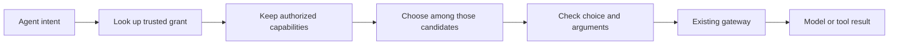
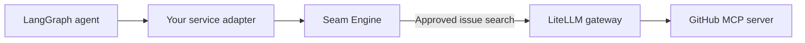
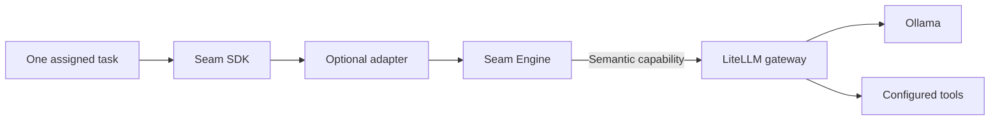

# Seam Engine


**A permission-aware decision layer in front of the gateway you already use.**

Seam Engine accepts an agent's intent, checks what that caller is allowed to do, and selects an approved **kind of capability**. Your existing gateway chooses the actual model, tool, provider, or MCP server that carries it out.

For example, “find an upstream issue about this error” might become `development.issue.search`. Engine selects that semantic route only if a trusted grant permits it. The gateway decides which configured GitHub tool performs the search.



**Permission comes first.** The decision engine never creates a capability or grants access. If a choice is uncertain, Engine applies a replaceable escalation policy; its default returns ambiguity.

## Where it fits

| Layer | Its job |
| --- | --- |
| Your agent runtime | Decide what the agent wants to accomplish |
| Seam Engine | Use a trusted caller identity and grant to choose a sanctioned semantic capability |
| Your existing gateway | Select and run the actual model, tool, provider, or MCP server |

Engine accepts generic callers. It does not require Seam SDK, a Seam ticket, or a Seam worker loop. [Seam SDK](https://github.com/Judge-M/Seam-SDK) is one optional caller among many.

## Try it without the SDK

The included [standalone example](examples/standalone.rs) uses a generic non-Seam caller, an in-memory trusted grant, and a fixture gateway. It needs no live model or credentials.

```sh
git clone https://github.com/Judge-M/Seam-Engine.git
cd Seam-Engine
cargo test --all-targets
cargo run --example standalone
```

The example shows authorization, a fixture decision, semantic routing, and a result. For a real deployment, supply a trusted `AuthoritySource`, a `DecisionEngine` or its gateway-backed adapter, an escalation policy, and a `Gateway` adapter.

## Example setups

These are **possible integrations**, not bundled connectors to the named products. An application or service adapter must translate its requests into Engine's generic subject, grant, intent, and argument types.

### 1. Add routing to a LangGraph agent

A [LangGraph](https://docs.langchain.com/oss/python/langgraph/workflows-agents) application could call Engine through a service adapter before using a [LiteLLM](https://docs.litellm.ai/docs/) gateway. An intent to search issues could become `development.issue.search`, then LiteLLM could execute a configured [GitHub MCP server](https://github.com/github/github-mcp-server). The LangGraph application keeps its own agent loop.



### 2. Put Engine behind a bounded Seam worker

The [combined example](https://github.com/Judge-M/Seam/tree/main/examples/combined) shows an optional adapter from Seam SDK's two ports to Engine. In a deployment, a gateway such as LiteLLM could map a semantic inference route to [Ollama](https://docs.ollama.com/api/openai-compatibility) and an external route to its configured tools. Engine does not choose a concrete Ollama model.



## How the decision stays bounded

1. The integrating service authenticates the caller and passes a trusted subject identity. An `AuthoritySource` resolves that subject's grant from trusted state; caller-supplied permission claims are not trusted.
2. Engine filters its logical capability catalog to the granted set **before** asking for a semantic choice.
3. A generic `DecisionEngine` chooses only from supplied candidates. Routing can narrow a large catalog across multiple namespace layers.
4. Deterministic code checks candidate membership, confidence, grant expiry, and argument schema before gateway execution.
5. The `Gateway` adapter sends the chosen semantic capability to your existing gateway. The gateway owns concrete execution.

The included `GatewayDecisionEngine` sends internal decisions such as `seam.decision.choice` through the same replaceable gateway boundary. That control route must be configured directly in the gateway, without sending it back through Engine. It is separate from caller capabilities and cannot widen the caller's grant.

Engine does not host models, manage provider credentials, replace an AI or MCP gateway, or run worker loops. It supplies the semantic decision and policy layer. For the broader picture, see the [Seam architecture](https://github.com/Judge-M/Seam).

Licensed under Apache-2.0. See [LICENSE](LICENSE).
